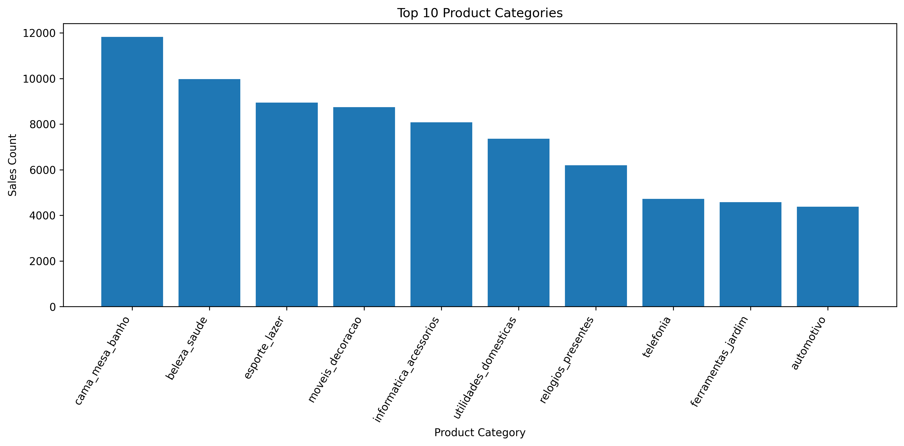
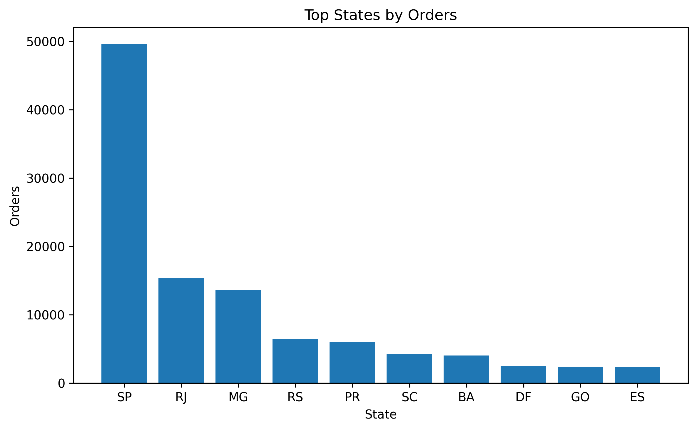
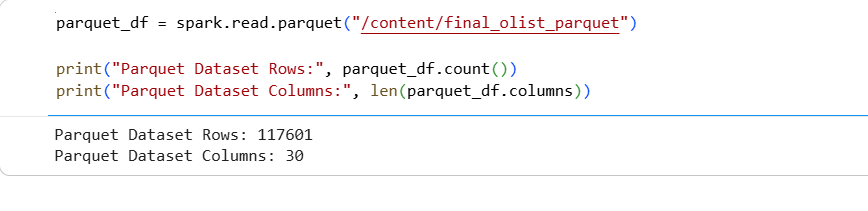

# B142 Data Integration Project

## Project Overview

This project demonstrates a complete data integration workflow using Apache Spark and the Brazilian Olist E-commerce Dataset. Multiple datasets were cleaned, transformed, integrated and analysed to generate business insights.

The project was developed as part of the B142 Data Integration module.

---

## Objectives

* Load multiple datasets into Apache Spark
* Perform data cleaning and preprocessing
* Handle missing values and duplicate records
* Integrate datasets using common keys
* Store the final integrated dataset in Parquet format
* Perform business analysis using Spark SQL
* Visualise key business insights

---

## Dataset

The project uses the Olist Brazilian E-commerce Dataset.

Dataset Source:

https://www.kaggle.com/datasets/olistbr/brazilian-ecommerce

---

## Technologies Used

* Apache Spark
* PySpark
* Spark SQL
* Python
* Google Colab
* Matplotlib
* GitHub

---

## Data Integration Workflow

1. Load datasets
2. Explore data structure
3. Clean missing values
4. Remove duplicates
5. Integrate datasets using joins
6. Store integrated dataset as Parquet
7. Perform business analysis
8. Create visualisations

---

## Key Results

### Top Product Categories

The category *cama_mesa_banho* generated the highest number of sales.

---

### Top States by Orders

São Paulo (SP) generated the highest number of customer orders.

---

### Dataset Integration Summary

Final Integrated Dataset:

* Rows: 117,601
* Columns: 30

---

## Repository Contents

* B142_Olist_Data_Integration_Project.ipynb
* README.md
* top_product_categories.png
* top_states_orders.png
* final_dataset_schema.png.png
* integration_summary.png.png

---

## Author

Adeyemi Jamiu Adegbenro

BSc Data Science, Artificial Intelligence and Digital Business

GISMA University of Applied Sciences
